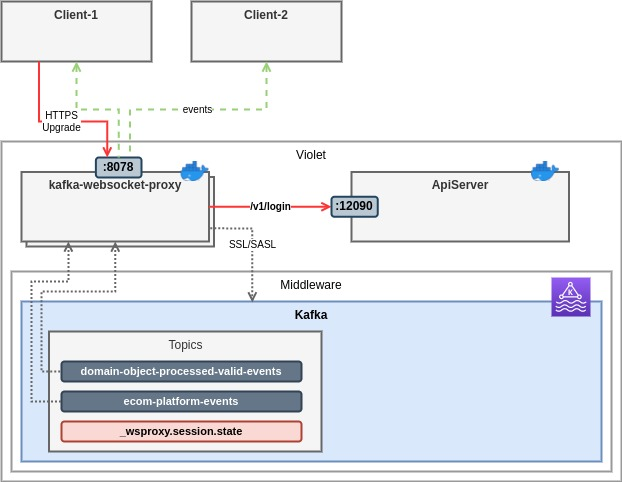

# Authenticationa and Authorization


## Federated Auth 

Authnetication will be perfromed on WebSocket connection handshake




### Configuration

| Parameter | Value | Description |
| ----------|-------|-------------|
|WSPROXY_FEDERATED_AUTH_ENABLED | Enable Authentication method| true |
|WSPROXY_FEDERATED_AUTH_URI     | Authentication Server URI   | Ex: http://172.17.0.1:12090/v1/login |
|WSPROXY_FEDERATED_AUTH_BODY    | POST body to pass to AuthServer| Ex: ```{"username": "{{user}}", "password": "{{pass}}"}'``` |
|WSPROXY_FEDERATED_AUTH_MAPPING | Websocket Connection Headers mapping to AuthServer | Ex: ``` HEADER:X-Violet-App-Id:X-Violet-App-Id,HEADER:X-Violet-App-Secret:X-Violet-App-Secret,BODY:X-Violet-User:user,BODY:X-Violet-Pass:pass```|

### Docker-Compose Setup
Example for ApiServer Authentication: [docker-compose-fedauth.yml](docker-compose-fedauth.yml)


__NOTE__: Authorization is not supported


